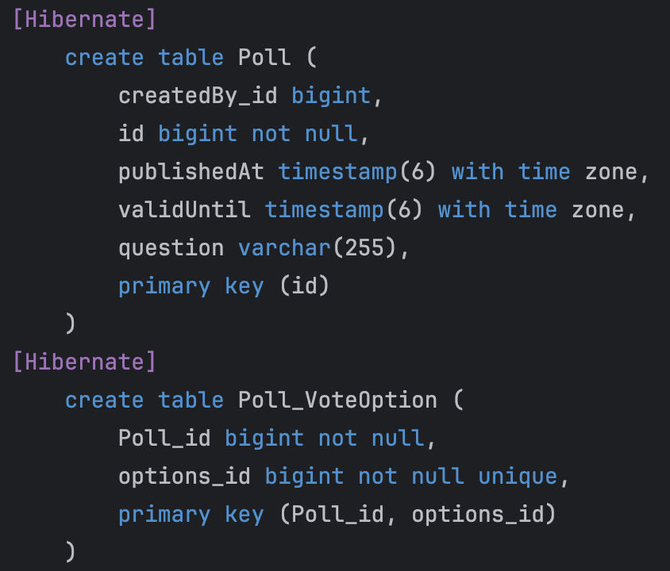
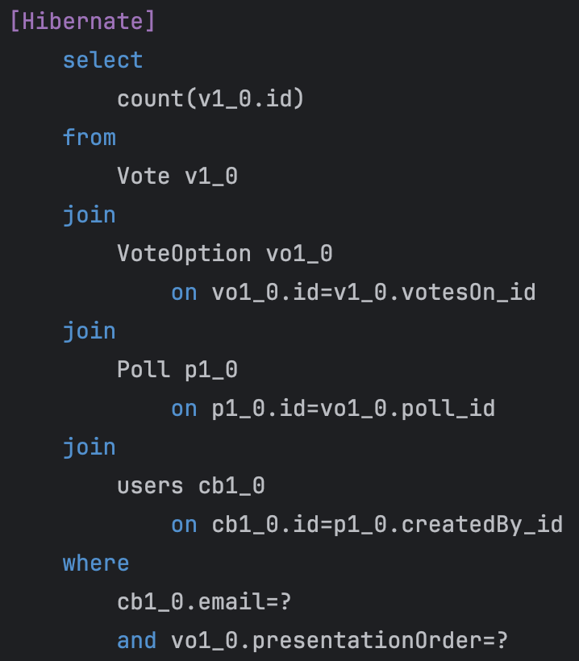

## Short report

When I started on the assignment, the description of the task was missing a
dependency so I used some time to figure out what was wrong with the 
`PersistenceConfiguration`. I started looking at `persistence.xml` 
because that was what the teacher showed in the lectures, but found
the missing dependency in the end. I decided to start from scratch
when making the entities by looking at the sql queries and analyze 
which fields I needed to make the test pass. I think this was
an easier approach as my old code from `expass2` is a bit messy.
Thus the entities are located inside `no.hvl.dat250.jpa.polls`.

In one of the tests the queries use `createNativeQuery` so I had to 
explicitly name the user table `users` to avoid errors. Additionally, 
I had to set the cascade option for some fields because they were
independent on the parent. Another issue encountered was that I 
originally used Lombok's `@Data` annotation which gave me a toString()
method for all fields, but this resulted in an infinite loop if there
were bidirectional associations.

For debugging purposes I found it useful to log the sql queries by
adding properties to `PersistenceConfiguration`. For example, in the image below 
we can see that Hibernate creates another table for handling 
the mapping associations between `Poll` and `VoteOption`. 

In addition, it was easier to see the full queries which includes 
which tables and conditions it used than looking at the
queries in one single line. This is for example shown 
in the second image.

I also made my own createQueries in the test to see the actual values
in the tables. This was to help me see what I was missing in the 
entities. For example by printing out the content of VoteOption
I saw that Poll was null, so no wonder I got an empty list. The 
problem was that I forgot to add poll to the constructor. 
For the final delivery I removed these print statements and queries.

### Links

- `User` - https://github.com/LillyTBui/dat250-poll-app/blob/jpa/src/main/java/no/hvl/dat250/jpa/polls/User.java
- `Poll` - https://github.com/LillyTBui/dat250-poll-app/blob/jpa/src/main/java/no/hvl/dat250/jpa/polls/Poll.java
- `Vote` - https://github.com/LillyTBui/dat250-poll-app/blob/jpa/src/main/java/no/hvl/dat250/jpa/polls/Vote.java
- `VoteOption` - https://github.com/LillyTBui/dat250-poll-app/blob/jpa/src/main/java/no/hvl/dat250/jpa/polls/VoteOption.java
- Link to branch where I worked on this assignment https://github.com/LillyTBui/dat250-poll-app/tree/jpa